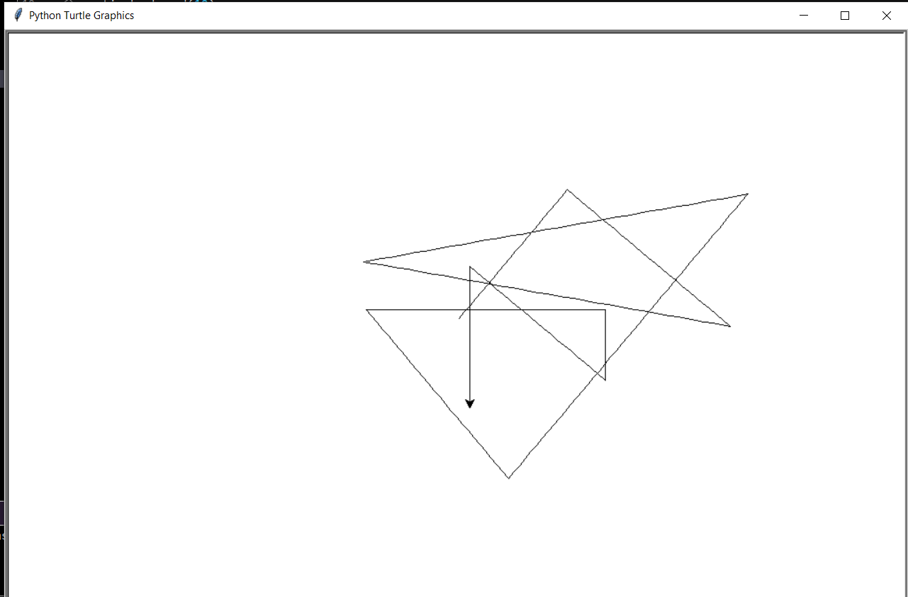

# Package/Script Name

The script name is LineSketch.py

## Setup instructions

python file.py

## Detailed explanation of script, if needed

Who doesn't love scribbling? So, If you are bored and want to draw something really funny and random,You can play this.
Just follow some instructions for directions, and you can end up with a new art.

## Key Bindings
   F- Move Forward
   D- Move backward
   A- Move Anti-Clockwise
   C- Move Clockwise
## Output

